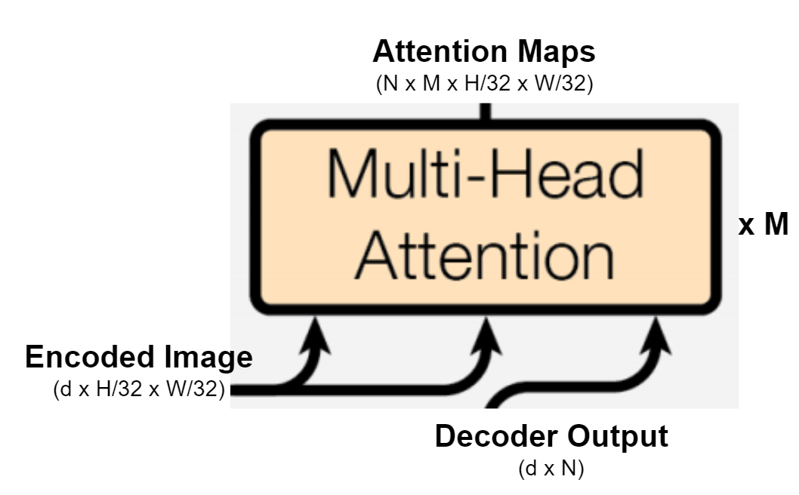

# CAPSTONE Submissions

- [Understanding the architecture for Panoptic Segmentation](#Understanding%20DETR.md#understanding-the-architecture-for-panoptic-segmentation)
  - [Multi Head Attention](#multi-head-attention)
  - [FPN style CNN](#fpn-style-cnn)
- [Sample](#sample)
- [Training a custom DeTr](#training-a-custom-detr)


# Understanding the architecture for Panoptic Segmentation


<p align="center">
  
</p>
Some of the details are not clear about this architecture which has been taken from the paper [End-to-End Object Detection with Transformers](https://arxiv.org/pdf/2005.12872.pdf). In this section of the paper, the author talks about using DETR for panoptic segmentation. It says that DETR can be extended for panoptic segmentation by adding a mask head to the decoder output. Quoting the paper on the same, *Panoptic segmentation unifies the typically distinct tasks of semantic segmentation (assign a class label to each pixel) and instance segmentation (detect and segment each object instance).*

The input image goes through the transformer network and is converted to attention maps, which are then converted into binary masks, which are further merged to create the panoptic segmentation. The original paper, just touches on these various blocks in the architecture and there is not much explanation available. Hence, I am putting down some details on each of these blocks here:


1. ## Multi Head Attention

To begin with, the input is 3xHxW, which is 3 channels. DETR uses Resnet50 backbone, which converts the input image to 2048 x H/32 x W/32. This is then projected to match the hidden dimension of the transformer network which is d and is 256 by default. This goes through the transformer encoder to creates a d x H/32 x W/32 Encoded Image. The encoder output is then fed to the decoder which also has N self-learning object queries as an input. These N object queries are transformed into an output embedding by the decoder. 

The decoder output, which is d x N class predictions is passed through a Multi head attention with M heads to get N x M x H/32 x W/32 Attention maps. An attention function is applied on the encoded images along with the class predictions. This means that the encoded images form the query and key vectors for the multi head attention. The decoder output, which is the N output embeddings for the predictions, is fed as queries to this block.

<p align="center">
  
</p>
The output from this is N x M x H/32 x W/32. Here N is the class predictions. These are the N attention maps, where each class has M classes and is of dimension H/32 x W/32.


2. ## FPN style CNN

Next, the resolution of these attention maps need to be increased so that it later can be masked on the image of original resolution. A FPN (Feature Pyramid Network) style CNN is used for the same which gets outputs from the backbone ResNet network and adds them to the convolution outputs. The backbone used here is Resnet50 which has 5 conv layers as is shown in this table.

<p align="center">
  
</p>

A FPN has 2 pathways, one Bottom-Up which is basically the ResNet50 backbone used in DETR and the other is the Top Down Pathway, used to create the Masks Logits. A more clear picture of all the inputs to the FPN style CNN is shown in the image below :

<p align="center">
  
</p>


Finally, a pixel-wise argmax is taken of each of the N predicted H/4 x W/4 mask logits, which gives the final 

# Sample

If you look at the [notebook](https://colab.research.google.com/github/facebookresearch/detr/blob/colab/notebooks/DETR_panoptic.ipynb) for Panoptic Segmentation that was shared by Facebook research. This is one of the test images of dimension 800 x1199

<p align="center">
  
</p>

When this image is passed through the DeTr model,

```
img = transform(im).unsqueeze(0)
out = model(img)
```

 the output gives 'pred_logits', 'pred_boxes', 'pred_masks'. 'pred_logits' is the scores computed for each predicted class. A plot of the 'pred_masks' with a confidence score more than 0.85 is shown here. It is clear from this that each output predicts a single class.

<p align="right">
  
</p>
These predictions are then combined to give the final segmentation. Note here that the out['pred_masks'] are of dimension 200 x 300. the postprocessing step involves merging the masks corresponding to the same stuff class and upscaling the them to the size of the original image .

```
result = postprocessor(out, torch.as_tensor(img.shape[-2:]).unsqueeze(0))[0]
```

<p align="right">
  
</p>

# Training a custom DeTr

As  a part of the Capstone project, I will train a DeTr to give out the Panoptic Segmentation on some classes for which the data was collected by the students. 

- In order to predict the Segmentation, the problem needs to be broken into two
  - Object detection model, for this the training dataset needs to have bounding boxes.
  - Segmentation Model, for this the segmentation labels will be used
- However, recent research has suggested that the two step process can be replaced as one where the Bipartite loss can be used directly to predict the segments. I intend to try and achieve this. 
