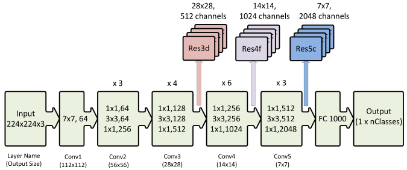

# Notes from session 2
nw - network
bw -b/w - between
info - information
diff - different

## Why do we use stride > 1

## Why we do not use max pooling a layer or two away from prediction?
Max pooling throws away 75% of info. CTO eg: throw away info at the point it is not required.
Once the info comes down to 7x7 etc, there is very less info which is redundant.
Also, we perform max pooling after we have extracted some features.

## How do we decide that max pooling is needed after these many layers?
Refer to session 1 which had the dog example. We zoomed into the dog image and looked at the lowest level at which a feature was available. This was a manual excercise, which helped us to make the first 5 layers and then we did the max pooling. For rest of arch, rohan asks us to repeat the same 5 layers with max pooling b/w them. More details later. Cant do max pool in first layer either. *check more about this*

## What are the (2) types of operation done by neural networks?

## What are the operations which we can do (on data and arch) to design our own image identification nw?
1. Zoom into the image and see the lowest features available.
2. Do not manipulate the size of image going IN the network. (you can do that outside your nw). We start loosing the info real soon because of that.
3. 

## Everyone starts at 224x224 or stops at 7x7?
To compare diff nw, everyone starts at 224x224. If someone started at 1000x1000 than they would have more features just to begin with.
At 7x7 there are enough features to fit more channels in the memory, so its prefferable than 5x5 or 3x3.

rlsOSGyJNOo
